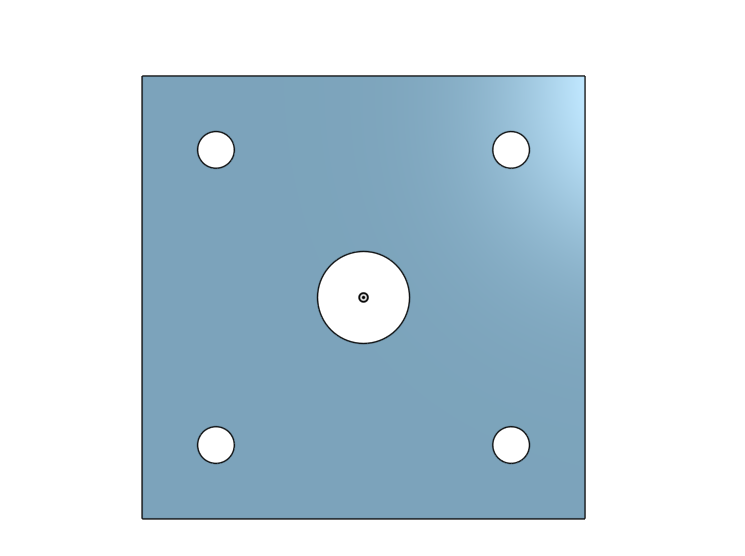
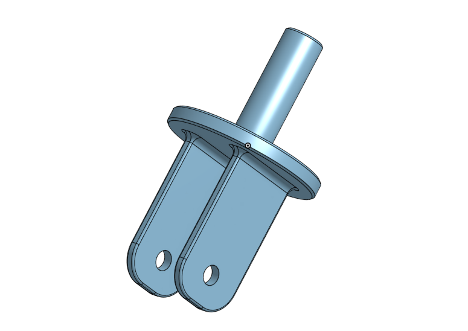

# BasicCAD

We are creating a caster.

---
## Table of Contents
* [Table of Contents](#Table-of-Contents)
* [Base](#Base)
* [Mount](#Mount)
* [Fork](#Fork)
* [Tire](#Tire)
* [Wheel](#Wheel)
* [AxleCollarBearings](#AxleCollarBearings)

## Base

### Description

The first assignment is to create the caster base.  The base's dimensions are 200 mm x 120 mm and 8 mm thick.  It has 6 holes 10 mm wide and 20 mm from the edge equally spaced along the edges.

### Evidence
[The Base in Onshape](https://cvilleschools.onshape.com/documents/0d70f655203ca304cb3c5b7d/w/f55603f962f6fc74f5548a68/e/41d730c570a8d75fce9f51b6)

### Image

### Reflection

This was my first Onshape part and [following along with Dr. Shields made it super easy.](https://www.youtube.com/watch?v=93BFUD-HAG8&feature=emb_title&scrlybrkr=5670f0b4)  I learned about 
* sketching (shortcut **shift-s**)
* constructions lines (shortcut **Q**)
* dimensions (shortcut **D**)
* extruding both add and remove (shortcut key **E**)
* linear patterns (no shortcut)

Onshape is awesome.  I found it really helpful to rename all my sketches.  It is going to be a GREAT year in engineering.

---

## Mount

### Description
The second part of the assignment was to build a mount.  It was a square with 120 mm length on each side. It is 8 mm thick and has 5 holes in it.  The 4 on the outside have a 10 mm diamiter and are 20 mm away from the edges of the mount.
### Evidence
https://cvilleschools.onshape.com/documents/477a7168462b719dce2ecfe8/w/cfca8ec627fb21f3b1844e2c/e/07547ad1e064ea80151bd06b
### Image

### Reflection
It was way easier than I thought it would be.  Following the video helped with getting through all the little setbacks I had.  I'm glad I am starting to figure this onshape stuff out.
---

## Fork

### Description
I just made the fork.  It is a circle that is 8 mm thick with 2 rectangles coming out that are curved at the top.  It also has a hole going through each of them that is 15 mm from the top.  The diamiter is 10 mm
### Evidence
https://cvilleschools.onshape.com/documents/6a71bb78f771e29a70fe1c26/w/5558a881b3c7eae21c163042/e/0ff7956273971672d7615be7
### Image

### Reflection
This part had a lot more steps and i had some trouble with the fillet tool.  I went to office hours to figure it out.  I think it is all starting to come together for me and I'm excited to see my final form of this project when I put it all together.
---

## Tire

### Description

### Evidence

### Image

### Reflection

---

## Wheel

### Description

### Evidence

### Image

### Reflection

---

## AxleCollarBearings

### Description

### Evidence

### Image

### Reflection

---
